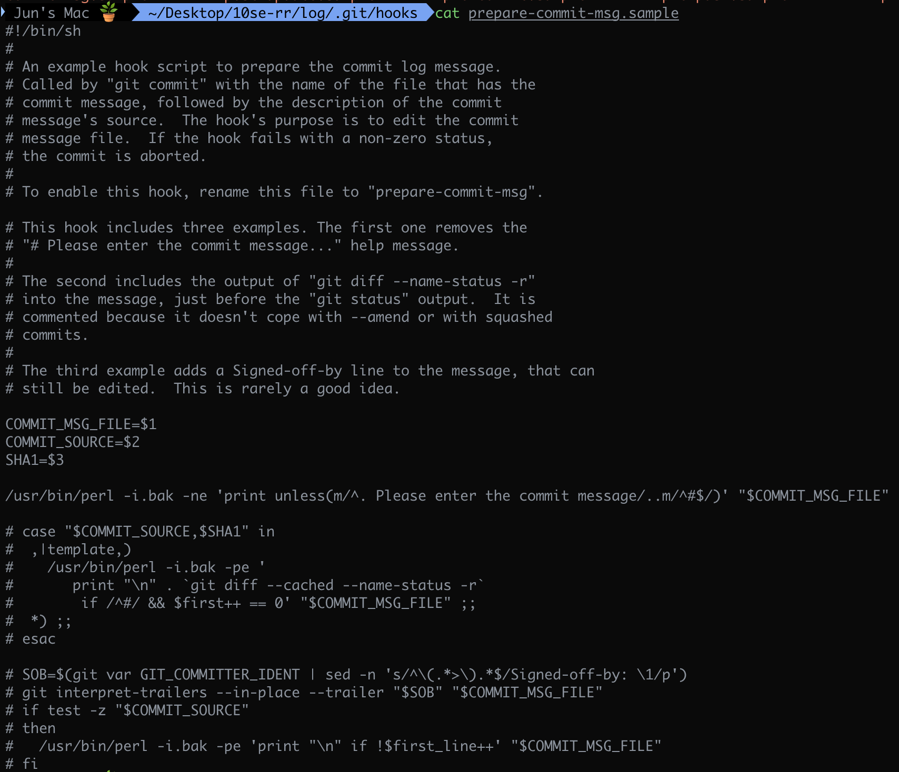

# Git hook으로 컨벤션 이모지

## index

[Git hook 사용하기](./git/Git-hook-사용하기.md) 에서 언급한 바와 같이 2가지 방법이 가능하다.
1. 로컬의 `./git/hook` 경로에 스크립트를 추가하는 방법

2. 원격 저장소 > Settings > Webhooks 메뉴에서 URL을 설정하는 방법


## 방법 1. 로컬 ./.git/hooks 수정


위는 `./.git/hook/` 디렉토리 안의 prepare-commit-msg.sample이다. 설명과 같이 `git commit` 명령어로 호출되고, `commit-file`과 `commit-message`를 인자로 받아서 실행된다. 이 훅의 목적은 커밋 메세지를 파일을 수정하기 위해 존재한다.

설명에 따르면 해당 파일을 통해서 커밋의 컨벤션에 맞춰서 이모지를 추가가 가능하다.

### [ prepare-commit-msg ]
    ```
    #!/usr/bin/env bash
    # .git/hooks/prepare-commit-msg

    MSG_FILE=$1
    SOURCE=$2

    # 1) 머지/스쿼시 커밋은 건너뛰기
    if [[ "$SOURCE" == "merge" || "$SOURCE" == "squash" ]]; then
    exit 0
    fi

    # 2) 첫 줄 읽기
    FIRST_LINE=$(head -n1 "$MSG_FILE")

    # 3) 키워드 매핑
    emoji=""
    new=${FIRST_LINE}

    if [[ "$FIRST_LINE" =~ ^init: ]]; then
    emoji="🎉"
    new="${FIRST_LINE#init: }"

    elif [[ "$FIRST_LINE" =~ ^feat: ]]; then
    emoji="✨"
    new="${FIRST_LINE#feat: }"

    elif [[ "$FIRST_LINE" =~ ^refactor: ]]; then
    emoji="♻️"
    new="${FIRST_LINE#refactor: }"

    elif [[ "$FIRST_LINE" =~ ^fix: ]]; then
    emoji="🔧"
    new="${FIRST_LINE#fix: }"

    elif [[ "$FIRST_LINE" =~ ^style: ]]; then
    emoji="💄"
    new="${FIRST_LINE#style: }"

    elif [[ "$FIRST_LINE" =~ ^docs: ]]; then
    emoji="📝"
    new="${FIRST_LINE#docs: }"

    elif [[ "$FIRST_LINE" =~ ^build: ]]; then
    emoji="🏗️"
    new="${FIRST_LINE#build: }"

    else
    # 매칭되는 키워드가 없으면 종료
    exit 0
    fi

    # 5) 메시지 앞뒤 공백 정리
    trimmed="$(echo "$new" | sed -E 's/^[[:space:]]+//;s/[[:space:]]+$//')"

    # 6) 파일 첫 줄을 이모지 + 내용으로 교체
    sed -i "1s~.*~$emoji $trimmed~" "$MSG_FILE"

    ```

### [ 실행시킬 파일 만들기 ]
    ```
    # setup-hooks.sh

    # 1) 리포지토리 최상위 경로에서 이름 추출
    REPO_NAME=$(basename "$(git rev-parse --show-toplevel)")

    # 2) hooks 경로 설정
    git config core.hooksPath hooks

    # 3) 사용자 메시지 출력
    echo "✔️ ${REPO_NAME}에 Custom 훅이 적용되었습니다."
    
    ```


## 2번 방법
1. 